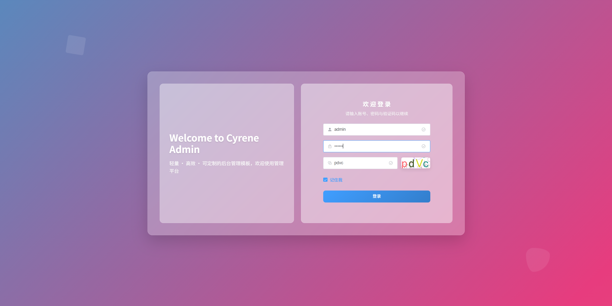
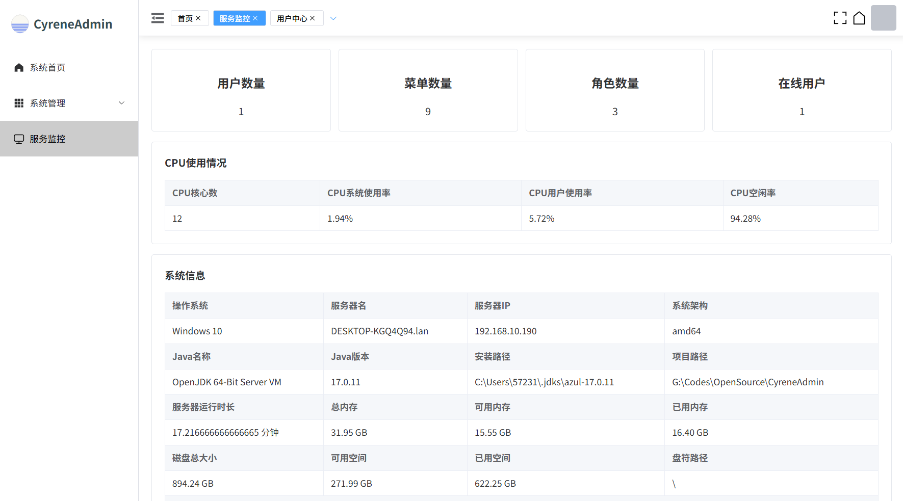
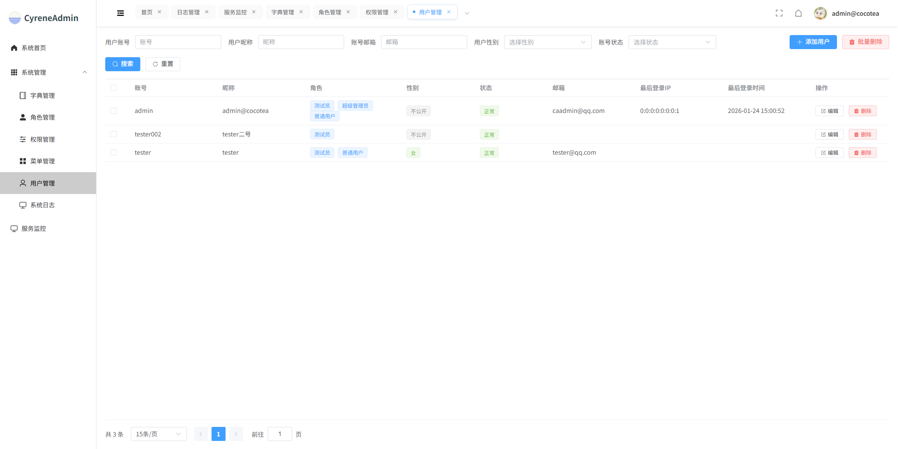
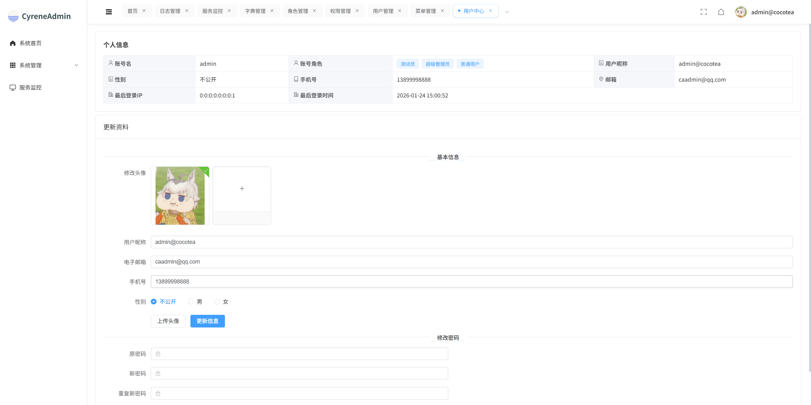

<div align="center">

# CyreneAdmin

</div>


<p align="center">
  
  
  
  
</p>

<p align="center">
  <a href="readme.md">简体中文</a> •
  <a href="README.en.md">English</a>
</p>

<p align="center">
  <a href="#introduction">Introduction</a> •
  <a href="#features">Features</a> •
  <a href="#tech-architecture">Tech Architecture</a> •
  <a href="#requirements">Requirements</a> •
  <a href="#quick-start">Quick Start</a> •
  <a href="#project-structure">Project Structure</a> •
  <a href="#license">License</a>
</p>

## Introduction

CyreneAdmin is a modern admin management system with dual-framework support (Spring Boot and Solon). It integrates complete permission management, user management, menu management, operation logs, and other core features. The project adopts a front-end/back-end separated architecture: the front-end is built on Vue3 + Element Plus, and the back-end offers a choice between two frameworks to meet the needs of different teams.

## Features

- 🔧 Dual-framework support: Both Spring Boot and Solon frameworks are supported
- 👤 RBAC permission control: Role-based access control with flexible configuration of menu and button permissions
- 📝 Operation logs: Records user operation behaviors
- 🔐 Security authentication: Integrated with the Sa-Token authentication framework
- 🛠️ Code standards: Follows mainstream coding conventions, easy to maintain and extend

## Default Account

- Administrator account: `admin` / `123456`

## Docker Deployment Demo

```shell
docker pull cocoteanet/cyrene-admin:latest
```

## Screenshots

<table>
  <tr>
    <td align="center">
      
      <br/>
    </td>
    <td align="center">
      
      <br/>
    </td>
  </tr>
  <tr>
    <td align="center">
      
      <br/>
    </td>
    <td align="center">
      
      <br/>
    </td>
  </tr>
</table>

## Tech Architecture

### Back-end Tech Stack

| Technology | Description | Version |
| --- | --- | --- |
| Java | Programming language | 17+ |
| Spring Boot | Application framework | 3.5.8 |
| Solon | Lightweight application framework | 3.7.2 |
| SQLToy | ORM framework | 5.6.56 |
| Sa-Token | Authentication framework | 1.44.0 |
| RedisX | Redis client | 1.4.7 |
| MySQL | Relational database | 8.x |
| Maven | Project build tool | 3.x |

### Front-end Tech Stack

| Technology | Description | Version |
| --- | --- | --- |
| Vue | Front-end framework | 3.5.13 |
| Element Plus | UI component library | 2.6.3 |
| Vue Router | Routing management | 4.x |
| Pinia | State management | 2.x |
| Axios | HTTP client | 1.7.8 |
| Vite | Build tool | 5.x |

## Requirements

- JDK 17+
- Maven 3.6+
- MySQL 8.0+
- Redis 5.0+
- Node.js 20+ (front-end)
- npm or yarn

## Project Structure

```
CyreneAdmin/
├── cyrene-common/              # Common module
│   ├── annotation/             # Custom annotations
│   ├── constant/               # Constants
│   ├── enums/                  # Enum types
│   ├── model/                  # Common models
│   ├── service/                # Common service interfaces and implementations
│   └── util/                   # Utility classes
├── cyrene-service-system/      # System service module
│   ├── model/                  # System models (dto/po/vo)
│   ├── service/                # System service interfaces and implementations
│   └── resources/sqltoy/       # SQL files
├── cyrene-starter-solon/       # Solon starter module
├── cyrene-starter-springboot/  # Spring Boot starter module
├── cyrene-ui/                  # Front-end UI module
└── scripts/                    # Script files
```

## License

This project is licensed under the MIT License. See the [LICENSE](LICENSE) file for details.

## Acknowledgements

Thanks to the following open-source projects for their contributions:

- [Solon](https://solon.noear.org/)
- [Spring Boot](https://spring.io/projects/spring-boot)
- [SQLToy](https://github.com/sagframe/sagacity-sqltoy)
- [Sa-Token](https://sa-token.cc/)
- [Hutools](https://hutool.cn/)
- [Vue.js](https://vuejs.org/)
- [Element Plus](https://element-plus.org/)
- [Vite](https://vitejs.dev/)