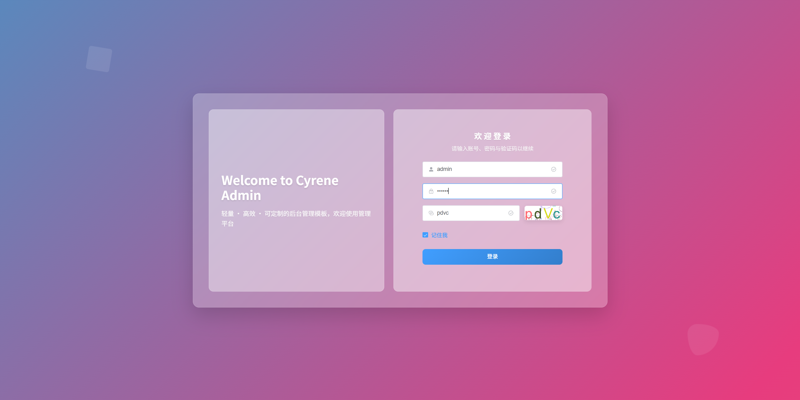
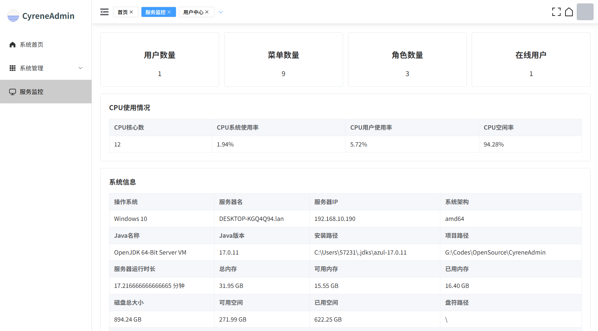
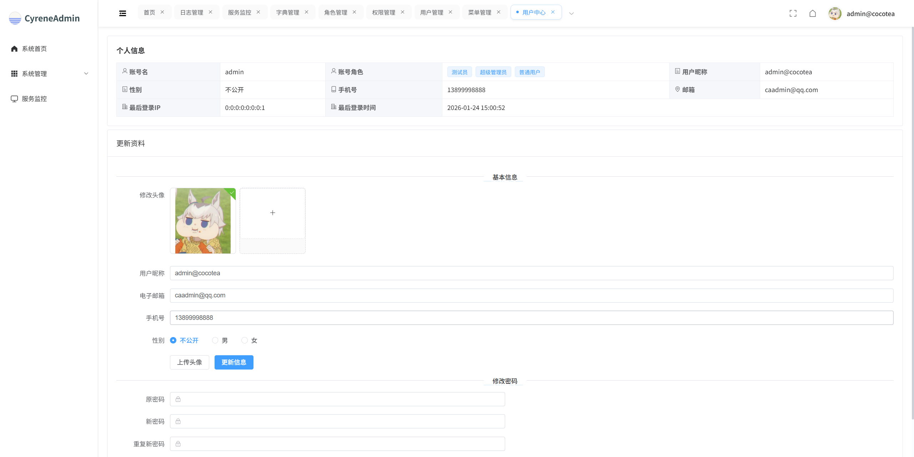

<div align="center">

# CyreneAdmin

</div>


<p align="center">
  
  
  
  
</p>

<p align="center">
  <a href="#简介">简介</a> •
  <a href="#特性">特性</a> •
  <a href="#技术架构">技术架构</a> •
  <a href="#环境要求">环境要求</a> •
  <a href="#快速开始">快速开始</a> •
  <a href="#项目结构">项目结构</a> •
  <a href="#许可证">许可证</a>
</p>

## 简介

CyreneAdmin 是一个现代化的后台管理系统，提供双框架支持（Spring Boot 和 Solon），集成了完善的权限管理、用户管理、菜单管理、操作日志等核心功能。该项目采用前后端分离架构，前端基于 Vue3 + Element Plus，后端提供两种框架选择，满足不同团队的需求。

## 特性

- 🔧 双框架支持：同时支持 Spring Boot 和 Solon 框架
- 👤 RBAC 权限控制：基于角色的访问控制，灵活配置菜单和按钮权限
- 📝 操作日志：记录用户操作行为
- 🔐 安全认证：集成 Sa-Token 权限认证框架
- 🛠️ 代码规范：遵循主流编码规范，易于维护和扩展

## 技术架构

### 后端技术栈

| 技术 | 说明 | 版本 |
| --- | --- | --- |
| Java | 编程语言 | 17+ |
| Spring Boot | 应用框架 | 3.5.8 |
| Solon | 轻量级应用框架 | 3.7.2 |
| SQLToy | ORM框架 | 5.6.56 |
| Sa-Token | 权限认证框架 | 1.44.0 |
| RedisX | Redis客户端 | 1.4.7 |
| MySQL | 关系型数据库 | 8.x |
| Maven | 项目构建工具 | 3.x |

### 前端技术栈

| 技术 | 说明 | 版本 |
| --- | --- | --- |
| Vue | 前端框架 | 3.5.13 |
| Element Plus | UI组件库 | 2.6.3 |
| Vue Router | 路由管理 | 4.x |
| Pinia | 状态管理 | 2.x |
| Axios | HTTP客户端 | 1.7.8 |
| Vite | 构建工具 | 5.x |

## 环境要求

- JDK 17+
- Maven 3.6+
- MySQL 8.0+
- Redis 5.0+
- Node.js 20+ (前端)
- npm 或 yarn

## 项目结构

```
CyreneAdmin/
├── cyrene-common/              # 公共模块
│   ├── annotation/             # 自定义注解
│   ├── constant/               # 常量定义
│   ├── enums/                  # 枚举类型
│   ├── model/                  # 公共模型
│   ├── service/                # 公共服务接口及实现
│   └── util/                   # 工具类
├── cyrene-service-system/      # 系统服务模块
│   ├── model/                  # 系统模型（dto/po/vo）
│   ├── service/                # 系统服务接口及实现
│   └── resources/sqltoy/       # SQL文件
├── cyrene-starter-solon/       # Solon启动模块
├── cyrene-starter-springboot/  # Spring Boot启动模块
├── cyrene-ui/                  # 前端UI模块
└── scripts/                    # 脚本文件
```

## 默认账户

- 管理员账号: `admin` / `123456`

## 演示图片

<table>
  <tr>
    <td align="center">
      
      <br/>
    </td>
    <td align="center">
      
      <br/>
    </td>
  </tr>
  <tr>
    <td align="center">
      
      <br/>
    </td>
    <td align="center">
      
      <br/>
    </td>
  </tr>
</table>

## 许可证

本项目采用 MIT 许可证，详情请参见 [LICENSE](LICENSE) 文件。

## 致谢

感谢以下开源项目的贡献：

- [Solon](https://solon.noear.org/)
- [Spring Boot](https://spring.io/projects/spring-boot)
- [SQLToy](https://github.com/sagframe/sagacity-sqltoy)
- [Sa-Token](https://sa-token.cc/)
- [Hutools](https://hutool.cn/)
- [Vue.js](https://vuejs.org/)
- [Element Plus](https://element-plus.org/)
- [Vite](https://vitejs.dev/)